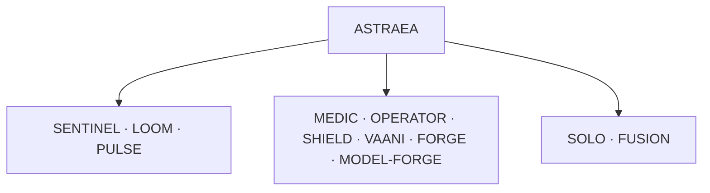

# ASTRAEA

> **Astraea** — the star-maiden who returned as a constellation. The platform where agent runs that die come back.


**Control plane for autonomous agents.** One company, six AI products, one shared brain —
every product usable solo or fused, everything real-time, nothing hardcoded.

```
ASTRAEA ─┬─ CORE SERVICES ── SENTINEL (LLM firewall) · LOOM (shared context fabric) · PULSE (telemetry bus)
          ├─ PRODUCTS ─────── MEDIC (AI SRE) · OPERATOR (computer-use) · SHIELD (AI SOC)
          │                   VAANI (voice AI employee) · FORGE (self-evolving) · MODEL-FORGE (our model)
          └─ WORKSPACES ───── SOLO (one module, only it runs) · FUSION (all modules, combined)
```

Full build spec: **[docs/MASTER_SPEC.md](docs/MASTER_SPEC.md)** · Operations: **[docs/RUNBOOK.md](docs/RUNBOOK.md)** ·
Architecture: **[docs/ARCHITECTURE.md](docs/ARCHITECTURE.md)** · Security: **[docs/SECURITY.md](docs/SECURITY.md)** ·
Deploy: **[docs/DEPLOY.md](docs/DEPLOY.md)**



## Quickstart

```bash
python3 main.py                 # full platform — every module heartbeat on
# `--profile sre` (or all) also boots demo microservices + the detector heartbeat
python3 main.py --check         # environment report only
```

Then open **http://localhost:3000** → create an account → console.

First run auto-creates the Python venv and installs frontend deps. API keys are **not
required** — add the free ones (see `.env.example`) to raise quality further.
Operations: **[docs/RUNBOOK.md](docs/RUNBOOK.md)**.

## Status

| Phase | Deliverable | Gate | Status |
|---|---|---|---|
| 0 | Skeleton: launcher, auth+tenancy, module registry, Blueprint console | clean clone → `python3 main.py` → login | lab shipped |
| 1 | Core runtime + SENTINEL + LOOM | event-sourced runs; JWT; vault | lab shipped |
| 2 | PULSE + MEDIC | Isolation Forest on demo services (`--profile sre`); ClickHouse optional | lab — not customer OTel |
| 3 | OPERATOR | Playwright + DOM + live `web.research`; OmniParser / OSWorld not default | lab shipped |
| 4 | SHIELD | Synthetic lab playbooks + MITRE map; not Wazuh/Suricata | lab shipped |
| 5 | VAANI | Browser WebSocket; Exotel only if env set | lab shipped |
| 6 | FORGE + MODEL-FORGE | SQL eval loop; not a 50-task public chart | lab shipped |
| 7 | Hardening | Alembic survives reboot; Vertex ADC; honest degrade | in progress |

### Production hardening (Milestones 1-6)

| Area | What shipped |
|---|---|
| Reliability | Durable **run queue + leased workers** — a run survives a worker crash and another worker resumes it from the last event (no rework). |
| Isolation | **Sandboxed tools** — shell/code run in a no-network, read-only, resource-capped Docker/gVisor container; loud host-rlimit fallback. |
| Telemetry | **OTLP/HTTP receiver** (`/api/pulse/v1/{logs,metrics,traces}`) → ClickHouse (sre profile); MEDIC `medic.telemetry` query tool. |
| Security graph | SHIELD attack graph in **Neo4j** (soc profile) + `shield.blast_radius` (Cypher, Postgres-BFS fallback). |
| Voice | VAANI **Exotel AgentStream** leg + optional **Sarvam** Indic STT/TTS; **DPDP** consent at t0 + PII masking before persistence. |
| Post-training | **GRPO** recipe (`notebooks/model_forge_grpo.md`) with an executable-SQL reward; champion registered behind SENTINEL as `pvu-sql`. |

See `docs/RUNBOOK.md` → *Production hardening* for operational detail and all 13 audited-bug fixes.

## The rules (enforced, not aspirational)

1. **Nothing hardcoded** — every threshold, prompt, rule and reference lives in the DB, editable in the console.
2. **Real-time everywhere** — streaming in, streaming out, live latency on every surface.
3. **Durable** — agent runs survive crashes, pause for approval across days, replay from any point.
4. **Provenance** — every learned artifact is stamped where it came from and where it was used.
5. **Benchmarked** — no module is done without its scoreboard.

## Security & memory architecture (v0.3)

- **Passwords**: Argon2id (64MB, time_cost=3), transparent upgrade from scrypt on login,
  escalating lockout (5 fails → 15 min) — every event audited. See [docs/SECURITY.md](docs/SECURITY.md).
- **Secrets vault**: AES-256-GCM at rest (`ASTRAEA_VAULT_KEY` or scrypt-from-JWT;
  do not change the KDF). Reveal is an explicit audited action. See Settings → Vault.
- **Audit trail**: logins, vault access, approvals — Settings → Security.
- **CSP + security headers** on every response; production boot fails fast without
  real secrets.
- **Vector memory (LOOM)**: ChromaDB + MiniLM embeddings — semantic search over
  everything your agents learned (`/api/loom/search`), RAG for MEDIC + VAANI.
- **SOLO/FUSION**: run one module or all — memory is always shared, so switching
  never loses context (Settings → Workspace).

## Improving accuracy to 95%+

The heuristic brain (no API key) caps at 75–85%. To reach 90–95%+:

1. **Vertex on GCloud** (`ASTRAEA_VERTEX_PROJECT`) or a **Gemini Studio key** → VLM + chat
2. **Optional Claude** (`ASTRAEA_ANTHROPIC_API_KEY`) or **Groq** → extra cloud brains
3. **Run Ollama locally** (`ollama pull llama3.2`) → offline fallback that always works
4. **Train on Colab** → `app/model_forge/train.py` for SFT+GRPO on a T4

## Recommended free HF models

| Purpose | Model | Why |
|---|---|---|
| Vision (OPERATOR) | `Qwen/Qwen2.5-VL-7B-Instruct` | Best open VLM for screen understanding |
| General chat | `Qwen/Qwen2.5-7B-Instruct` | Strong reasoning, tool calling |
| SQL specialist | `defog/sqlcoder-7b-2` | Purpose-built for text-to-SQL |
| STT | `Systran/faster-whisper-base` | Fast, accurate, CPU-friendly |
| TTS | `rhasspy/piper-voices` | Lightweight, streaming, many languages |
| Prompt-injection classifier | `ProtectAI/deberta-v3-prompt-injection` | Detects injections in ms on CPU |
| Embeddings | `sentence-transformers/all-MiniLM-L6-v2` | Fast, good quality, CPU |
