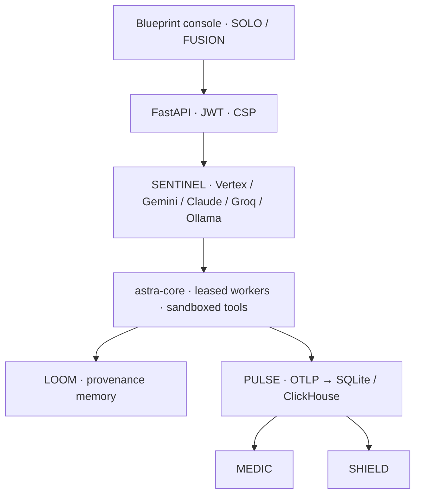
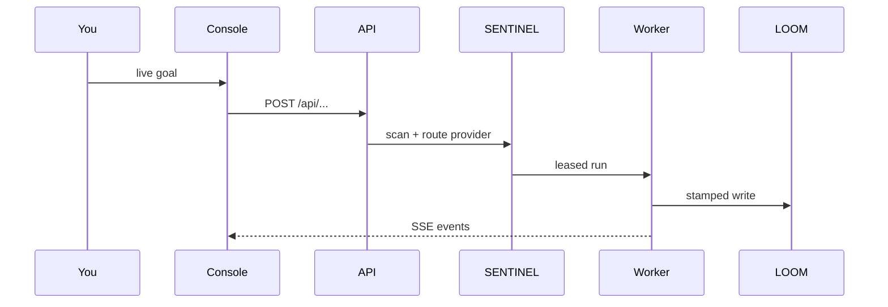
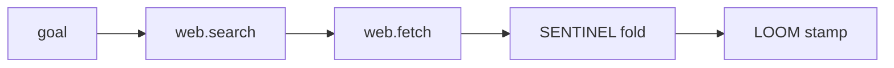

# ASTRAEA — Architecture

The control plane is one process tree: FastAPI + durable workers + the Blueprint
console. Offline on a laptop; the same binary on GCloud (Vertex) or later AWS.

Console twin: `/docs/architecture`.

## Control plane stack

## Request path

## OPERATOR web pipeline

Walled gardens (Google, ChatGPT, Claude, Cursor, GitHub login walls) skip the
headless click-loop after a successful research pack — those sites all produce
the same empty "gave up" screenshot. Public HTML is fetched per URL instead.

## Products

| Codename | Job |
|---|---|
| MEDIC | AI SRE on PULSE |
| OPERATOR | Live web + vision computer-use |
| SHIELD | AI SOC, MITRE, blast radius |
| VAANI | Voice employee, DPDP-masked |
| FORGE | Nightly skill promotion |
| MODEL-FORGE | Domain SQL model behind SENTINEL |
