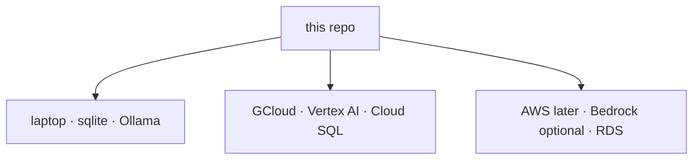

# ASTRAEA — Deploy (offline, GCloud, AWS later)

Same tree everywhere. Console twin: `/docs/deploy`.



## Offline / laptop

```bash
cp .env.example .env
# optional: ollama pull llama3.2
python3 main.py
```

No API key is required. SENTINEL falls through to Ollama / MODEL-FORGE / MLX.
OPERATOR research needs outbound HTTPS for DuckDuckGo or Brave; without a
network, computer-use still runs against local HTML fixtures.

## GCloud + Vertex AI

Two Cloud Run services. The browser talks only to the **console**. The console
proxies `/api/astraea/*` to the API so CORS, mixed-content and IAM never sit
between a guest login and Vertex.

1. `gcloud auth login` and `gcloud config set project YOUR_PROJECT`.
2. Enable APIs: `run.googleapis.com`, `aiplatform.googleapis.com`, `artifactregistry.googleapis.com`.
3. Grant the Cloud Run runtime service account `roles/aiplatform.user`.

Gemini 3.8 Flash and Gemini 3.1 Pro preview are **global** Vertex models
([locations](https://docs.cloud.google.com/gemini-enterprise-agent-platform/resources/locations)).
A regional `us-central1-aiplatform.googleapis.com` URL 404s them. Astraea
auto-routes `gemini-3*` to `https://aiplatform.googleapis.com/.../locations/global/`.

From Cloud Shell, after a deploy:

```bash
PROJECT=$(gcloud config get-value project)
REGION=us-central1
NUM=$(gcloud projects describe $PROJECT --format='value(projectNumber)')
SA="${NUM}-compute@developer.gserviceaccount.com"

gcloud services enable aiplatform.googleapis.com
gcloud projects add-iam-policy-binding $PROJECT \
  --member="serviceAccount:${SA}" \
  --role="roles/aiplatform.user"

gcloud run services update astraea-api --region $REGION \
  --update-env-vars "ASTRAEA_VERTEX_PROJECT=${PROJECT},ASTRAEA_VERTEX_LOCATION=global,ASTRAEA_VERTEX_DEFAULT_MODEL=gemini-3.8-flash"

# Prove Vertex itself works as you (not the Cloud Run SA):
curl -sS -X POST \
  -H "Authorization: Bearer $(gcloud auth print-access-token)" \
  -H "Content-Type: application/json" \
  "https://aiplatform.googleapis.com/v1/projects/${PROJECT}/locations/global/publishers/google/models/gemini-3.8-flash:generateContent" \
  -d '{"contents":[{"role":"user","parts":[{"text":"Reply with exactly VERTEX OK"}]}]}'

API_URL=$(gcloud run services describe astraea-api --region $REGION --format='value(status.url)')
curl -sS "$API_URL/health"
# expect llm.ok true, llm.provider vertex, llm.model gemini-3.8-flash, vertex_ready true
```

Pro chat: set `ASTRAEA_VERTEX_DEFAULT_MODEL=gemini-3.1-pro-preview`.

If `vertex_configured` is true but `vertex_ready` is false, ADC failed —
the Cloud Run SA cannot mint a token. The curl above working from Cloud
Shell only proves *your user* can call Vertex, not the service account.

```bash
PROJECT=$(gcloud config get-value project)
REGION=us-central1
JWT=$(python3 -c 'import secrets; print(secrets.token_hex(32))')
INGEST=$(python3 -c 'import secrets; print(secrets.token_hex(24))')

# ── secrets live in Secret Manager, never in the deploy command line or in
#    `gcloud run services describe` output ─────────────────────────────────
printf '%s' "$JWT"    | gcloud secrets create astraea-jwt-secret    --data-file=-
printf '%s' "$INGEST" | gcloud secrets create astraea-ingest-token --data-file=-
# the Cloud Run runtime SA must read them:
NUM=$(gcloud projects describe $PROJECT --format='value(projectNumber)')
SA="${NUM}-compute@developer.gserviceaccount.com"
gcloud secrets add-iam-policy-binding astraea-jwt-secret \
  --member="serviceAccount:${SA}" --role="roles/secretmanager.secretAccessor"
gcloud secrets add-iam-policy-binding astraea-ingest-token \
  --member="serviceAccount:${SA}" --role="roles/secretmanager.secretAccessor"

# ── build into Artifact Registry (gcr.io is deprecated) ───────────────────
gcloud artifacts repositories create astraea --repository-format=docker \
  --location=$REGION 2>/dev/null || true
gcloud builds submit --config deploy/cloudbuild.api.yaml \
  --substitutions _REGION=$REGION,_IMAGE=${REGION}-docker.pkg.dev/${PROJECT}/astraea/api:latest
gcloud run deploy astraea-api --image ${REGION}-docker.pkg.dev/$PROJECT/astraea/api:latest \
  --region $REGION --allow-unauthenticated --memory 1Gi --cpu 1 --timeout 300 \
  --max-instances 2 \
  --set-secrets "ASTRAEA_JWT_SECRET=astraea-jwt-secret:latest,ASTRAEA_INGEST_TOKEN=astraea-ingest-token:latest" \
  --set-env-vars "ASTRAEA_ENV=production,ASTRAEA_VERTEX_PROJECT=${PROJECT},ASTRAEA_VERTEX_LOCATION=global,ASTRAEA_VERTEX_DEFAULT_MODEL=gemini-3.8-flash,ASTRAEA_LLM_PROVIDER_ORDER=vertex,gemini,anthropic,groq,ollama,ASTRAEA_EMBEDDER=hash"

API_URL=$(gcloud run services describe astraea-api --region $REGION --format='value(status.url)')

gcloud builds submit --config deploy/cloudbuild.console.yaml \
  --substitutions _REGION=$REGION,_IMAGE=${REGION}-docker.pkg.dev/${PROJECT}/astraea/console:latest
gcloud run deploy astraea-console --image ${REGION}-docker.pkg.dev/$PROJECT/astraea/console:latest \
  --region $REGION --allow-unauthenticated --memory 512Mi --timeout 300 \
  --set-env-vars "ASTRAEA_USE_API_PROXY=1,ASTRAEA_PUBLIC_API_URL=${API_URL}"

CONSOLE_URL=$(gcloud run services describe astraea-console --region $REGION --format='value(status.url)')
gcloud run services update astraea-api --region $REGION \
  --update-env-vars "ASTRAEA_CORS_ORIGINS=${CONSOLE_URL}"
```

### Run the migrations (Alembic as a Cloud Run job)

The API binds `PORT` immediately and creates missing tables on boot, but the
canonical schema path is Alembic — run it once per release before opening traffic:

```bash
gcloud run jobs deploy astraea-migrate \
  --image ${REGION}-docker.pkg.dev/$PROJECT/astraea/api:latest \
  --region $REGION --max-retries 1 --task-timeout 10m \
  --set-secrets "ASTRAEA_JWT_SECRET=astraea-jwt-secret:latest" \
  --set-env-vars "ASTRAEA_ENV=production" \
  --command alembic --args upgrade,head
gcloud run jobs execute astraea-migrate --region $REGION --wait
```

(Attach `--add-cloudsql-instances` + the Cloud SQL env vars here too, once the
database section below is done.)

### Live run events across instances

The in-process event bus (SSE) is per-instance. With `--max-instances 1` (the
default recommendation for the API: one instance serves high concurrency) every
streaming client and every run worker share the same bus and live events flow.
With multiple API instances, a client may attach to a different instance than
the one executing a run — events then arrive on the next reconnect's backlog
replay. If you scale out and want push latency, the upgrade path is a shared
bus (Pub/Sub) — the `publish()` seam in `app/shared/bus.py` is the only place
that needs it.

### Chaos in production

`POST /api/pulse/chaos` is **403 in production** by default (`ASTRAEA_CHAOS_ENABLED=1`
opts back in). Fault injection distorts the telemetry MEDIC learns from — it is
a lab instrument, not a production toy. The SHIELD benign-traffic lab loop is
also production-off by code.

Verify:

```bash
curl -sS "$API_URL/health"
# want vertex_ready: true, llm.ok: true, llm.provider: vertex, llm.model: gemini-3.8-flash
# vertex_configured only means ASTRAEA_VERTEX_PROJECT is set — it is not a live probe
```

Then open the console, **continue as guest**, Chat, and OPERATOR research.
Chat streams tokens from Vertex (`gemini-3.8-flash` by default; set
`ASTRAEA_VERTEX_DEFAULT_MODEL=gemini-3.1-pro-preview` for Pro). Empty messages are
rejected. There is no canned assistant copy. OPERATOR falls through to Wikipedia
when DuckDuckGo returns 0 hits from Cloud Run; set `ASTRAEA_BRAVE_API_KEY` for a
real web index.

MEDIC watches this API process's live latency/errors (and any OTLP you ingest).
SHIELD records real logins and SENTINEL blocks. VAANI uses the browser speech
APIs plus Vertex for the brain.

## Durable database (Cloud SQL)

Attach a Postgres instance so guests, runs and memory survive scale-to-zero:

```bash
gcloud sql instances create astraea --database-version=POSTGRES_16 \
  --cpu=1 --memory=4Gi --region=$REGION --root-password="$INGEST"
gcloud sql databases create astraea --instance=astraea
gcloud sql users create astraea --instance=astraea --password="$JWT"

gcloud run services update astraea-api --region $REGION \
  --add-cloudsql-instances=$PROJECT:$REGION:astraea \
  --update-env-vars "ASTRAEA_CLOUD_SQL_INSTANCE=$PROJECT:$REGION:astraea,ASTRAEA_DATABASE_USER=astraea,ASTRAEA_DATABASE_PASSWORD=${JWT},ASTRAEA_DATABASE_NAME=astraea"
```

Or set `ASTRAEA_DATABASE_URL=postgresql+psycopg://...` directly. A writable
`/mnt/astraea` volume is used for sqlite when mounted.

Optional: `ASTRAEA_VERTEX_ACCESS_TOKEN` or `ASTRAEA_VERTEX_API_KEY` if ADC is
not available. Optional Claude: `ASTRAEA_ANTHROPIC_API_KEY`. Optional search:
`ASTRAEA_BRAVE_API_KEY`. Without Brave, OPERATOR tries DuckDuckGo then Wikipedia.

## Enterprise GA operations

### Backups + point-in-time recovery (Cloud SQL)

Cloud SQL is the system of record — enable automated backups and PITR the
moment the instance exists (the instance created above predates GA hardening;
this is the one-command retrofit):

```bash
gcloud sql instances patch astraea --region $REGION \
  --backup-start-time 03:00 --enable-point-in-time-recovery \
  --retained-backups-count 30
```

- PITR window is then 30 days of binary logs; restore to any second in it:
  `gcloud sql instances clone astraea astraea-restored --point-in-time "2026-09-19T03:04:05"`.
- Full-restore drill (run quarterly, for real): clone → point a scratch Cloud
  Run service at the clone → `curl /health` + log in + open a run.
- Laptop/sqlite deployments have NO automatic backup — `sqlite3 data/astraea.db
  ".backup 'backups/astraea-$(date +%F).db'"` in a cron is the minimum.

### Durable artifacts (patches, FORGE champion memory)

MEDIC patches and FORGE's champion mirror are written through
`app/shared/artifacts.py`. With `ASTRAEA_ARTIFACT_BUCKET` set (a GCS bucket)
they survive instance death; without it they live on the container disk —
fine for a laptop, wrong for multi-instance Cloud Run.

```bash
gcloud storage buckets create gs://$PROJECT-astraea-artifacts --location=$REGION
gcloud storage buckets add-iam-policy-binding gs://$PROJECT-astraea-artifacts \
  --member="serviceAccount:${SA}" --role="roles/storage.objectAdmin"
gcloud run services update astraea-api --region $REGION \
  --update-env-vars ASTRAEA_ARTIFACT_BUCKET=$PROJECT-astraea-artifacts
```

On boot after a recycle, FORGE restores `champion.json` from the bucket into
its git memory repo (`forge/eval.py: ensure_repo`) and commits the restoration.

### Ingesting your real infrastructure (OTel collector)

PULSE speaks OTLP/HTTP — point any OpenTelemetry Collector at the API to move
MEDIC/SHIELD from lab telemetry onto your real services. The ingest endpoints
authenticate with `ASTRAEA_INGEST_TOKEN` via the `X-Internal-Token` header.

```yaml
# otel-collector-config.yaml — exporter stanza
exporters:
  otlphttp/astraea:
    endpoint: https://astraea-api-xxxx.run.app/api/pulse
    headers:
      X-Internal-Token: "${env:ASTRAEA_INGEST_TOKEN}"
service:
  pipelines:
    metrics: { receivers: [otlp], exporters: [otlphttp/astraea] }
    logs:    { receivers: [otlp], exporters: [otlphttp/astraea] }
    traces:  { receivers: [otlp], exporters: [otlphttp/astraea] }
```

Routes: `/api/pulse/v1/metrics`, `/api/pulse/v1/logs`, `/api/pulse/v1/traces`
(`backend/app/pulse/otlp.py`). Start with one pilot service, watch MEDIC's
anomaly baselines learn for a week before trusting its pages.

### Multi-instance scaling — what is now safe

With Cloud SQL attached, the platform is multi-instance-safe:

- **Run queue**: leases + `FOR UPDATE SKIP LOCKED` — two instances never
  execute the same run.
- **Live SSE**: the bus fans out over Postgres `LISTEN/NOTIFY`
  (`shared/bus.py`, active automatically on postgres). Run events now reach
  SSE clients on any instance; oversized events arrive as a compact envelope
  and the client replays full content from the DB.
- **Login throttling**: the sliding window and lockout live in
  `login_attempts` — shared across instances, so 5 bad passwords from any
  edge lock the pair everywhere.
- **Artifacts**: with the bucket set, patches/champion state are instance-loss
  tolerant.

Still per-instance (harmless, documented): pulse/shield detector heartbeats may
double-fire on rare scale-out moments — anomaly writes carry cooldowns keyed on
the DB, so worst case is a duplicate check, never duplicate alerts. Watch the
`max-instances` budget; each instance runs its own ONNX/MiniLM warmup.

## AWS (same tree, no code fork)

The container contract is plain HTTP + env — anything that runs a container
and health-checks `/health` works. Recommended mapping:

| Concern | GCloud (above) | AWS equivalent |
|---|---|---|
| Container runtime | Cloud Run | ECS Fargate (or App Runner) |
| Image registry | Artifact Registry | ECR |
| Postgres | Cloud SQL | RDS Postgres (same `ASTRAEA_DATABASE_URL`) |
| Secrets | Secret Manager | Secrets Manager (`ASTRAEA_*` env injected at task def) |
| LLM | Vertex (ADC) | Bedrock/Claude via `ASTRAEA_ANTHROPIC_API_KEY`, or keep Gemini keys |
| Build | Cloud Build | CodeBuild (same `docker build` commands) |

Sketch (Fargate + RDS):

```bash
aws ecr create-repository --repository-name astraea/api
docker build -t astraea-api -f deploy/Dockerfile.api .
docker tag astraea-api:latest $ACCOUNT.dkr.ecr.$REGION.amazonaws.com/astraea/api:latest
# migrate: run the same image once as a one-off ECS task with
#   command: ["alembic", "upgrade", "head"]
#   ASTRAEA_DATABASE_URL=postgresql+psycopg://... (RDS, in the task's secrets)
# then run the API task with the same env + ASTRAEA_ENV=production
```

Notes:
- No `K_SERVICE` on AWS, so the production boot guards demand real secrets —
  set `ASTRAEA_JWT_SECRET` (32+) and `ASTRAEA_INGEST_TOKEN` or the task refuses
  to start (deliberate: fail fast beats silent ephemeral secrets).
- The health check is `GET /health` (returns 200 once serving, `boot_failed`
  with the reason otherwise). Configure it as the ALB/ECS health check.
- Keep `--max-instances 1` semantics in mind: run one API task (or an
  ALB-sticky session) for live SSE push; scale-out needs the shared-bus
  upgrade described above — the seam is `app/shared/bus.py`.

## Production boot guards

On a laptop, `ASTRAEA_ENV=production` still refuses to boot without
`ASTRAEA_JWT_SECRET` (32+) and `ASTRAEA_INGEST_TOKEN`. On Cloud Run (`K_SERVICE`
set) those two are generated ephemerally if omitted so the container can bind
`PORT` — set real secrets so sessions survive instance recycle. CORS regex
allows `https://*.us-central1.run.app`; still set `ASTRAEA_CORS_ORIGINS` to
the console origin.
