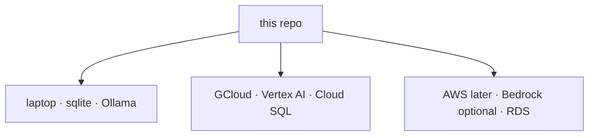

# ASTRAEA — Deploy (offline, GCloud, AWS later)

Same tree everywhere. Console twin: `/docs/deploy`.



## Offline / laptop

```bash
cp .env.example .env
# optional: ollama pull llama3.2
python3 main.py
```

No API key is required. SENTINEL falls through to Ollama / MODEL-FORGE / MLX.
OPERATOR research needs outbound HTTPS for DuckDuckGo or Brave; without a
network, computer-use still runs against local HTML fixtures.

## GCloud + Vertex AI

1. `gcloud auth application-default login` and set the project.
2. Enable Vertex Generative AI on the project.
3. In `.env`:

```
ASTRAEA_ENV=production
ASTRAEA_JWT_SECRET=<32+ chars>
ASTRAEA_VAULT_KEY=<32-byte hex>
ASTRAEA_INGEST_TOKEN=<set>
ASTRAEA_VERTEX_PROJECT=your-project
ASTRAEA_VERTEX_LOCATION=us-central1
ASTRAEA_LLM_PROVIDER_ORDER=vertex,gemini,anthropic,groq,ollama,model_forge,mlx_local
```

Optional: `ASTRAEA_VERTEX_ACCESS_TOKEN` or `ASTRAEA_VERTEX_API_KEY` if ADC is
not available in the runtime. Optional Claude: `ASTRAEA_ANTHROPIC_API_KEY`.
Optional search: `ASTRAEA_BRAVE_API_KEY` (DuckDuckGo is the zero-key default).

Cloud Run / GCE / GKE: ship the API image (`deploy/Dockerfile.api`), mount
secrets as env, point `ASTRAEA_DATABASE_URL` at Cloud SQL
(`postgresql+psycopg://...`). The Cloud Run metadata server is ADC — SENTINEL
picks Vertex when `ASTRAEA_VERTEX_PROJECT` is set. Set:

```
ASTRAEA_CORS_ORIGINS=https://YOUR_CONSOLE.run.app
ASTRAEA_PUBLIC_API_URL=https://YOUR_API.run.app
```

```bash
docker build -t astraea-api -f deploy/Dockerfile.api .
gcloud run deploy astraea-api --source . --allow-unauthenticated \
  --set-env-vars ASTRAEA_ENV=production,ASTRAEA_VERTEX_PROJECT=YOUR_PROJECT
```

Grant the Cloud Run service account `roles/aiplatform.user`.

## AWS later

No code fork. Point the database at RDS, keep SENTINEL's provider order, add
Bedrock as another provider when you need it. Object storage and queues stay
behind the existing env contract (`ASTRAEA_*`).

## Production boot guards

The process refuses to start in `ASTRAEA_ENV=production` without a real JWT
secret and ingest token. Set `ASTRAEA_CORS_ORIGINS` to the public console origin.
