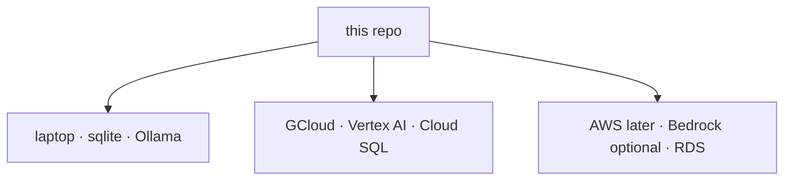

# ASTRAEA — Deploy (offline, GCloud, AWS later)

Same tree everywhere. Console twin: `/docs/deploy`.



## Offline / laptop

```bash
cp .env.example .env
# optional: ollama pull llama3.2
python3 main.py
```

No API key is required. SENTINEL falls through to Ollama / MODEL-FORGE / MLX.
OPERATOR research needs outbound HTTPS for DuckDuckGo or Brave; without a
network, computer-use still runs against local HTML fixtures.

## GCloud + Vertex AI

Two Cloud Run services. The browser talks only to the **console**. The console
proxies `/api/astraea/*` to the API so CORS, mixed-content and IAM never sit
between a guest login and Vertex.

1. `gcloud auth login` and `gcloud config set project YOUR_PROJECT`.
2. Enable APIs: `run.googleapis.com`, `aiplatform.googleapis.com`, `artifactregistry.googleapis.com`.
3. Grant the Cloud Run runtime service account `roles/aiplatform.user`.

```bash
PROJECT=$(gcloud config get-value project)
REGION=us-central1
JWT=$(python3 -c 'import secrets; print(secrets.token_hex(32))')
INGEST=$(python3 -c 'import secrets; print(secrets.token_hex(24))')

gcloud builds submit --config deploy/cloudbuild.api.yaml
gcloud run deploy astraea-api --image gcr.io/$PROJECT/astraea-api \
  --region $REGION --allow-unauthenticated --memory 1Gi --cpu 1 --timeout 300 \
  --set-env-vars "ASTRAEA_ENV=production,ASTRAEA_JWT_SECRET=${JWT},ASTRAEA_INGEST_TOKEN=${INGEST},ASTRAEA_VERTEX_PROJECT=${PROJECT},ASTRAEA_VERTEX_LOCATION=${REGION},ASTRAEA_LLM_PROVIDER_ORDER=vertex,gemini,anthropic,groq,ollama,ASTRAEA_EMBEDDER=hash,ASTRAEA_CORS_ORIGINS=https://astraea-console-${PROJECT}.${REGION}.run.app"

API_URL=$(gcloud run services describe astraea-api --region $REGION --format='value(status.url)')

gcloud builds submit --config deploy/cloudbuild.console.yaml
gcloud run deploy astraea-console --image gcr.io/$PROJECT/astraea-console \
  --region $REGION --allow-unauthenticated --memory 512Mi --timeout 300 \
  --set-env-vars "ASTRAEA_USE_API_PROXY=1,ASTRAEA_PUBLIC_API_URL=${API_URL}"

CONSOLE_URL=$(gcloud run services describe astraea-console --region $REGION --format='value(status.url)')
gcloud run services update astraea-api --region $REGION \
  --update-env-vars "ASTRAEA_CORS_ORIGINS=${CONSOLE_URL}"
```

Verify:

```bash
curl -sS "$API_URL/health"
# {"status":"ok"|"starting", "vertex_configured": true, ...}
```

Then open the console, **continue as guest**, Chat, and OPERATOR research.
Chat streams tokens from Vertex (`gemini-2.5-flash` by default; set
`ASTRAEA_VERTEX_DEFAULT_MODEL=gemini-2.5-pro` for Pro). Empty messages are
rejected. There is no canned assistant copy.

MEDIC watches this API process's live latency/errors (and any OTLP you ingest).
SHIELD records real logins and SENTINEL blocks. VAANI uses the browser speech
APIs plus Vertex for the brain.

## Durable database (Cloud SQL)

Attach a Postgres instance so guests, runs and memory survive scale-to-zero:

```bash
gcloud sql instances create astraea --database-version=POSTGRES_16 \
  --cpu=1 --memory=4Gi --region=$REGION --root-password="$INGEST"
gcloud sql databases create astraea --instance=astraea
gcloud sql users create astraea --instance=astraea --password="$JWT"

gcloud run services update astraea-api --region $REGION \
  --add-cloudsql-instances=$PROJECT:$REGION:astraea \
  --update-env-vars "ASTRAEA_CLOUD_SQL_INSTANCE=$PROJECT:$REGION:astraea,ASTRAEA_DATABASE_USER=astraea,ASTRAEA_DATABASE_PASSWORD=${JWT},ASTRAEA_DATABASE_NAME=astraea"
```

Or set `ASTRAEA_DATABASE_URL=postgresql+psycopg://...` directly. A writable
`/mnt/astraea` volume is used for sqlite when mounted.

Optional: `ASTRAEA_VERTEX_ACCESS_TOKEN` or `ASTRAEA_VERTEX_API_KEY` if ADC is
not available. Optional Claude: `ASTRAEA_ANTHROPIC_API_KEY`. Optional search:
`ASTRAEA_BRAVE_API_KEY` (DuckDuckGo is the zero-key default).

## AWS later

No code fork. Point the database at RDS, keep SENTINEL's provider order, add
Bedrock as another provider when you need it. Object storage and queues stay
behind the existing env contract (`ASTRAEA_*`).

## Production boot guards

On a laptop, `ASTRAEA_ENV=production` still refuses to boot without
`ASTRAEA_JWT_SECRET` (32+) and `ASTRAEA_INGEST_TOKEN`. On Cloud Run (`K_SERVICE`
set) those two are generated ephemerally if omitted so the container can bind
`PORT` — set real secrets so sessions survive instance recycle. CORS regex
allows `https://*.us-central1.run.app`; still set `ASTRAEA_CORS_ORIGINS` to
the console origin.
