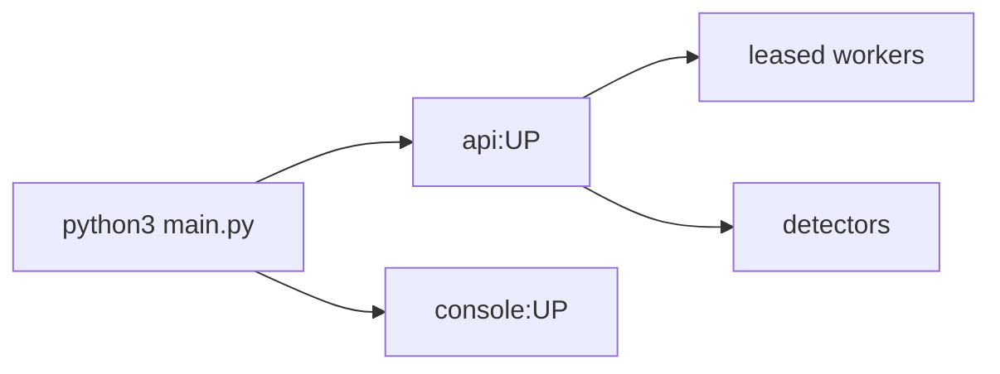

# ASTRAEA — Runbook

Operations manual for the running platform. Spec: `docs/MASTER_SPEC.md`.
Architecture / security / deploy: `docs/ARCHITECTURE.md`, `docs/SECURITY.md`, `docs/DEPLOY.md`.



## Run

```bash
python3 main.py                 # full platform — every module heartbeat on
python3 main.py --profile sre   # SOLO: boot demo microservices + ClickHouse profile for MEDIC
python3 main.py --no-frontend   # API only
python3 main.py --check         # environment report only
python3 main.py --down          # stop docker infra
```

- The launcher shifts ports upward when they collide and writes the resolved
  ports to `data/runtime.json`; the console discovers the API port from there.
- Storage: sqlite single-node by default, postgres when docker infra is up.
  The word "lite" is retired — every module heartbeat (pulse detector, shield
  detector, forge consolidator) runs on every boot, docker or not.

## Environment

Canonical prefix: `ASTRAEA_` (see `.env.example`). Legacy `PUNARVASU_*` keys in
`.env` or the process environment are auto-aliased at import, but new code and
configs must only use `ASTRAEA_*`.

- `ASTRAEA_JWT_SECRET` — **set before real users**; if empty, an ephemeral secret
  is minted per boot and every session dies on restart.
- `ASTRAEA_CORS_ORIGINS` — lock down in production. Dev allows `localhost:*` on
  any port (the launcher shifts ports freely).
- `ASTRAEA_INGEST_TOKEN` — internal pipeline token; demo services authenticate
  with `X-Internal-Token`. Dev default: `dev-internal`.

## Health & self-test

```bash
curl localhost:8000/health                 # {"app": "astraea", ...}
curl localhost:8000/api/system/selftest \  # per-module smoke paths (needs a token)
     -H "Authorization: Bearer $TOKEN"
```

`selftest` checks: database, pulse detector, shield detector, forge
consolidator, telemetry freshness, LLM provider chain, tool sandbox. The
console header polls it every 30s and shows one status chip.

## Self-healing (what runs automatically)

A watchdog loop (`backend/app/main.py`) every 30s:

1. restarts any dead detector/consolidator heartbeat (`start()` is idempotent),
2. marks runs stuck in `running` >5 min as `interrupted` (resumable),
3. every 10 min, deletes expired guest workspaces that hold no runs.

Startup additionally dedupes accumulated sentinel rule overrides.

## Verification after boot (2-minute smoke)

1. Console → MEDIC → *Inject random fault* → anomaly appears ≤ 30s, a MEDIC run
   spawns and parks at the approval gate.
2. Console → SHIELD → *Fire random attack* → incident appears ≤ 15s with ATT&CK
   mapping and a SHIELD run.
3. Console → Runs → launch `human-gate-demo` → approve the gate → run completes
   and the artifact lands in LOOM (`FROM CONSOLE`).
4. Console → FORGE → *Eval prompt variant* → score appears on the chart.

## Security operations

- Passwords: Argon2id (64MB); legacy scrypt hashes auto-upgrade on next login.
- Lockout: 5 failed logins per email+IP → 15-minute lock (HTTP 423).
- Vault: AES-256-GCM; set `ASTRAEA_VAULT_KEY` (32 bytes hex/base64) in production.
  Do not change the vault KDF/salt — existing ciphertext would not decrypt.
  Reveals are logged in the audit trail (Settings → Security).
- LLM: Vertex (`ASTRAEA_VERTEX_PROJECT`) first on GCloud, then Gemini / Claude / Groq / Ollama.
- OPERATOR web: `POST /api/operator/research` + tools `web.search` / `web.fetch` / `web.research`.
  DuckDuckGo by default; `ASTRAEA_BRAVE_API_KEY` optional.
- Vector memory: `data/chroma` (ChromaDB). MiniLM embeddings download once;
  offline fallback is deterministic hashed embeddings. Delete the directory to rebuild
  (it backfills from LOOM on boot).
- SOLO/FUSION switch: Settings → Workspace. Detectors honor it per tenant; LOOM
  memory is shared in every mode.

## Production hardening (Milestones 1-6)

- **Durable run queue** — runs are event-sourced and leased: `engine.spawn` runs in-process
  under a lease + heartbeat, and `run_workers` (`ASTRAEA_RUN_WORKERS`, default 1) claim
  queued/interrupted runs and resume any run whose worker died (lease expiry → requeue).
  A standalone worker process can run `app.core.worker.run_worker`. Tunables:
  `ASTRAEA_RUN_LEASE_SECONDS` (30), `ASTRAEA_RUN_WORKER_POLL_SECONDS` (1.0).
- **Sandboxed tools** — shell/code tools run in an ephemeral Docker container
  (`--network none --read-only`, CPU/memory/pids caps; gVisor `runsc` auto-used when
  installed). Without Docker it degrades — loudly, logged once — to host rlimits. Toggle:
  `ASTRAEA_SANDBOX_ENABLED`, image/limits via `ASTRAEA_SANDBOX_*`.
- **OTLP telemetry** — an OTel Collector/SDK can export to `POST /api/pulse/v1/{logs,metrics,traces}`
  (OTLP-JSON). With `ASTRAEA_CLICKHOUSE_URL` set (sre profile) telemetry lands in ClickHouse and
  MEDIC gains the `medic.telemetry` query tool (services ranked by a metric).
- **SHIELD attack graph** — persisted to Neo4j when `ASTRAEA_NEO4J_URL` is set (soc profile),
  Postgres otherwise; `shield.blast_radius` answers "what could the attacker reach" via Cypher
  (or a Postgres BFS fallback).
- **VAANI telephony + DPDP** — Exotel AgentStream at `/ws/vaani/exotel` (same pipeline, translated
  wire); optional Sarvam Indic STT/TTS (`ASTRAEA_SARVAM_API_KEY`, `ASTRAEA_VAANI_{STT,TTS}_PROVIDER=sarvam`).
  A consent notice is announced at t0 and Aadhaar/PAN/phone/card/email are masked before any
  transcript is persisted (`ASTRAEA_VAANI_PII_MASKING`).
- **MODEL-FORGE GRPO** — cloud SFT+GRPO recipe in `notebooks/model_forge_grpo.md` using the
  executable-SQL reward in `app/model_forge/grpo_reward.py`; promote with
  `serving.register_champion(path)` → served behind SENTINEL as `pvu-sql`.

## Troubleshooting

| Symptom | Cause | Fix |
|---|---|---|
| `api did not become healthy` at boot, then all green | older launcher pre-0.3 health check | update `main.py`; health must report `app: astraea` |
| Public pages (`/contact`, `/faq`, `/blog`) 500 only in `next dev` | Next.js dev-server caches a stale missing-module path when a page was added after the dev server started | restart the dev server, or use the production build (`next build && next start`) — clean there |
| MEDIC shows faults but never detects | demo services can't reach the API (wrong ingest URL/token) | boot via `main.py` (it passes `ASTRAEA_INGEST_URL/TOKEN`), check `data/runtime.json` port |
| 401 after every restart | `ASTRAEA_JWT_SECRET` empty | set it in `.env` |
| Runs page shows `[object Object]` | pre-0.3 frontend error rendering | update `frontend/lib/api.ts` |
| OPERATOR returns the same empty result on Google / ChatGPT / Claude / Cursor | those hosts are login walls; the old click-loop always "gave up" | use **Live web research** (`POST /api/operator/research`) — each card is that URL's live HTML. Walled-garden tasks now skip Playwright after a successful research pack |
| Console shows "Failed to fetch" from another machine | pre-0.3 hardcoded localhost | update `frontend/lib/api.ts` (uses `window.location.hostname`) |
| Two databases in `data/` | legacy `seed_blogs.py` default | 0.3+ uses the canonical URL only; delete stray `punarvasu.db` after backup |
