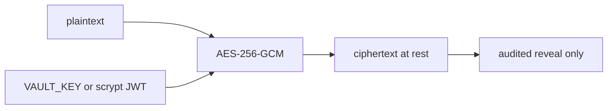

# ASTRAEA — Security

Production controls. Console twin: `/docs/security`.

## Password + session

| Control | Detail |
|---|---|
| **Argon2id** | `time_cost=3`, `memory_cost=65536` (64MB), `parallelism=2` |
| **scrypt upgrade** | Legacy hashes verify; next successful login re-hashes to Argon2id |
| **Lockout** | 5 failures / email+IP → 15 min (HTTP 423); every attempt in the audit log |
| **JWT** | HS256, `jti`, 24h default. Production boot fails without `ASTRAEA_JWT_SECRET` (32+) |

Do not change the Argon2id parameters on a live database without a migration
plan — existing hashes would stop verifying.

## Vault (AES-256-GCM)

- Cipher: AES-256-GCM, 12-byte nonce, tag appended (`nonce_hex:ciphertext_hex`).
- Key: `ASTRAEA_VAULT_KEY` (32 bytes hex or base64) **or** scrypt-derived from
  the JWT secret (`n=2^14`, salt `astraea-vault-v1`).
- **Do not change the KDF or salt** — that invalidates every stored secret.
- Plaintext is never listed. Reveal is an explicit, audited API.

## Model traffic

Every completion goes through SENTINEL: injection / jailbreak / Indic-PII on
input, streaming output scan, per-tenant token quota. Providers (Vertex, Gemini,
Claude, Groq, Ollama, MODEL-FORGE) are chosen at runtime — nothing hardcoded.

## Egress + tools

- `http_get` / `web.fetch` refuse localhost and RFC1918 (SSRF).
- Shell/code tools run in Docker/gVisor (`--network none --read-only`) or a
  loud host-rlimit fallback.
- CSP + security headers on every HTTP response.

## Voice (DPDP)

Consent is spoken at t0. Aadhaar / PAN / phone / card / email are masked before
any transcript is persisted (`ASTRAEA_VAANI_PII_MASKING`).
